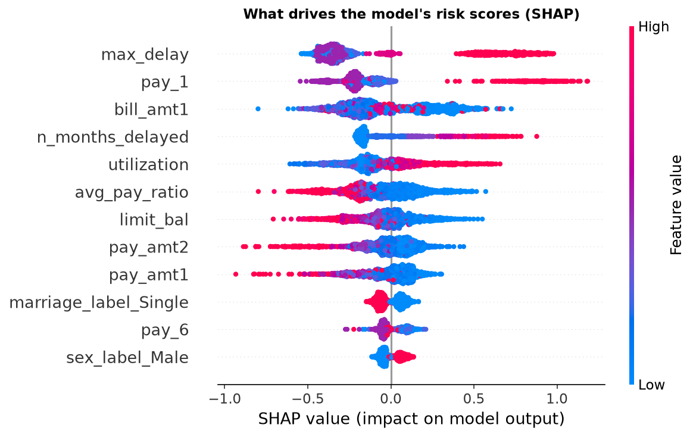
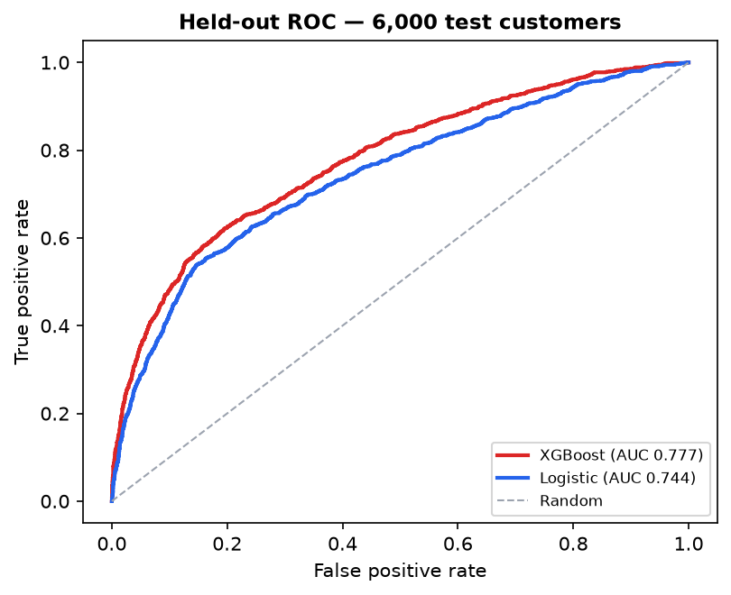

# Credit Card Default Risk Analysis

**Portfolio risk analytics on 30,000 credit card customers — PostgreSQL-compatible SQL (window functions, CTEs), Python (pandas, scikit-learn), explainable ML (XGBoost + SHAP), and an LLM layer that drafts the weekly risk memo.**

[**View Live Dashboard on Tableau Public →**](DASHBOARD_LINK_HERE)

## Business Question

Which customers are likely to default next month, how concentrated is that risk, and what should a card risk team do about it — this week, not next quarter?

## Key Findings

- **Default risk is behavioral and highly concentrated.** The 4% of customers with a 3+ month delinquency in the last six months default at **62.9%** — 5.4x the on-time segment (11.7%). Demographics barely move the needle by comparison.
- **Deterioration is an early-warning signal, not just the level.** Customers whose repayment status worsened month-over-month 3+ times default at **56.5%** vs **15.1%** for stable customers — flaggable 1–2 statements before serious delinquency, early enough for a payment plan instead of collections.
- **A transparent 3-signal rule already concentrates risk.** A rule-based tier (delinquency level + utilization + trend) puts **12.8% of the book** into a High tier that defaults at **51.0%** and holds **29.5% of all future defaults** — deployable without any ML sign-off.
- **The ML model turns 10% of outreach capacity into 31% of defaults.** XGBoost's top-scored decile defaults at **68.7%** (portfolio average: 22.1%), a **3.1x lift** over random outreach; the top two deciles capture **50.2%** of all defaults.
- **Utilization risk climbs steadily above ~15% usage** (14.8% → 28.7% default rate from decile 4 to 10). The bottom deciles are non-monotonic — near-zero-bill accounts include dormant-then-default cases — which is why utilization is a supporting signal, not the lead one.

## Approach

- **Data:** UCI "Default of Credit Card Clients" — 30,000 customers, Taiwan 2005, 24 raw features
- **SQL (5 analyses):** demographic default rates, behavior segmentation, utilization deciles (`NTILE`), month-over-month repayment deterioration (`LAG` over an unpivoted ledger), and a rule-based risk-tier flag. Written in PostgreSQL-compatible ANSI SQL, executed with DuckDB
- **Python:** cleaning + feature engineering (utilization, max delay, repayment trend, payment ratio), 5 EDA charts
- **Models:** logistic regression (the explainable baseline a model-risk committee can approve) vs XGBoost (the accuracy benchmark), SHAP to close the explainability gap, decile lift table to translate AUC into business terms
- **AI layer:** `ai_insights/` — an LLM drafts the weekly risk memo from aggregated results only (no customer-level data leaves the machine; prompt forbids numbers not present in the inputs)

## Model Performance

Held-out test set: 6,000 customers (stratified 80/20 split), base default rate 22.1%.

| Metric | Logistic Regression | XGBoost |
|---|---|---|
| ROC AUC | 0.744 | **0.777** |
| Top-decile default rate | — | 68.7% |
| Top-decile capture (share of all defaults) | — | 31.0% (3.1x lift) |
| Top-2-decile cumulative capture | — | 50.2% |

Top SHAP drivers: worst delinquency (`max_delay`), most recent repayment status (`pay_1`), current bill size, months delayed, and utilization — consistent with the SQL findings, which is exactly what you want: the model agrees with the analysis.




The metric that matters to a portfolio manager isn't AUC — it's *"if we can only call 10% of the book, how many future defaulters do we reach?"* That's the lift table.

## Repository Structure

```
sql/            5 analysis queries + runner; results/ holds each query's output
src/            01 data prep -> 02 EDA charts -> 03 models (run in order)
charts/         EDA + ROC + SHAP output (PNG)
ai_insights/    LLM risk-memo generator, prompt, sample output
data/           raw UCI file, cleaned CSV, Tableau extracts
reports/        model metrics, lift table, logistic coefficients
```

## Reproduce

```bash
python -m venv .venv && .venv\Scripts\activate   # Windows
pip install -r requirements.txt
python src/01_data_prep.py
python sql/run_queries.py
python src/02_eda_charts.py
python src/03_models.py
```

## What I'd Do Differently With More Time

- Temporal validation (train on early months, test on later) instead of a random split — closer to how the model would deploy
- Probability calibration (Platt/isotonic) so scores can price risk, not just rank it
- A cost matrix: false negatives (missed defaulters) cost more than false positives (unnecessary outreach) — pick the operating threshold from expected loss, not accuracy
- Swap the rule-based risk tiers for model-score tiers and A/B test the outreach

## Companion Project

This is the analytics half of a two-project credit-card portfolio. The engineering half — [banking-transactions-api](https://github.com/Lego514/banking-transactions-api) — is a Spring Boot transaction service with atomic transfers and row-level locking. One decides who gets credit; the other moves the money safely.

## About Me

Yi-Lei (Ray) Li — MSCS, University of Delaware (May 2026), Wilmington DE. Open to Data Analyst and Software Engineer roles. [GitHub](https://github.com/Lego514)
